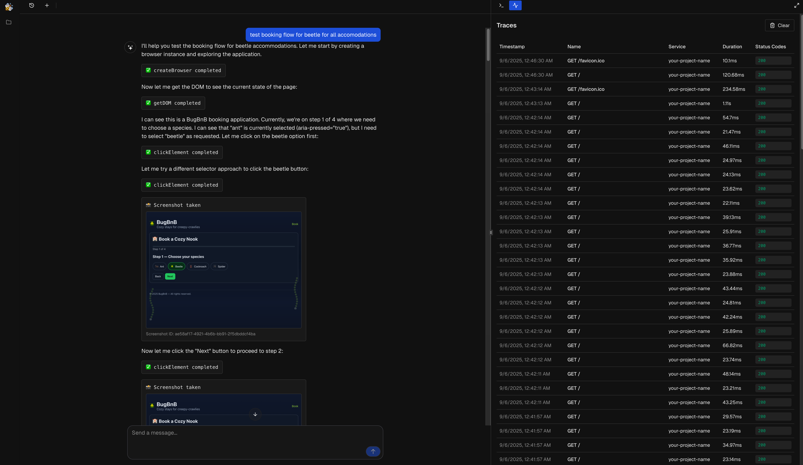

<h3 align="center">
  
</h3>

# Bug0

A QA Agent that runs on your local machine and can debug / test Next.js applications. Bug0 runs the app, instruments it automatically, and uses browser automation to perform comprehensive testing.



## Features

- **Automated Testing**: Runs comprehensive tests on Next.js applications
- **Auto-Instrumentation**: Automatically instruments your application for testing
- **Browser Automation**: Uses Puppeteer for real browser testing
- **Local Development**: Runs entirely on your local machine
- **Real-time Monitoring**: Tracks application performance and errors
- **Trace Analysis**: Detailed trace analysis and debugging
- **Process Management**: Monitors and manages application processes
- **Screenshot Capture**: Takes screenshots during testing for visual debugging

## Tech Stack

- **App**: Next.js
- **Testing**: Puppeteer, Browser Automation
- **AI**: AI SDK, Vercel AI Gateway
- **Monitoring**: OpenTelemetry, Custom Tracing
- **UI Components**: Shadcn

## Getting Started

### Prerequisites

- Node.js (v18 or higher)
- pnpm (preferred package manager)

### Installation

```bash
# Clone the repository
git clone https://github.com/alex-holovach/Bug0.git
cd Bug0

# Install dependencies
pnpm install

# Install Chrome browser for Puppeteer
npx puppeteer browsers install chrome

# Set up environment variables
echo "AI_GATEWAY_KEY=your-ai-gateway-key" > .env.local

# Start the development server
pnpm dev
```

## Usage

1. **Start Bug0**: Run `pnpm dev` to start the Bug0 interface
2. **Connect Your App**: Point Bug0 to your Next.js application
3. **Run Tests**: Bug0 will automatically instrument and test your application
4. **View Results**: Monitor test results, traces, and screenshots in the dashboard
5. **Debug Issues**: Use the integrated debugging tools to fix identified problems

Visit `http://localhost:3000` to access the Bug0 dashboard.

## Contributing

Contributions are welcome! Please feel free to:

1. Open issues for bugs or feature requests
2. Submit PRs for new functionality
3. Fork the project for your own use

## License

This project is licensed under the MIT License - see the [LICENSE](LICENSE) file for details.

---

*Bug0 - Intelligent QA automation for Next.js applications*
